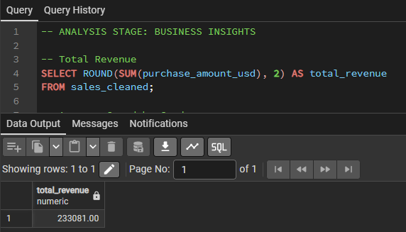
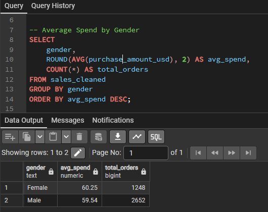
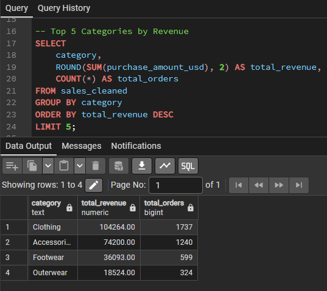
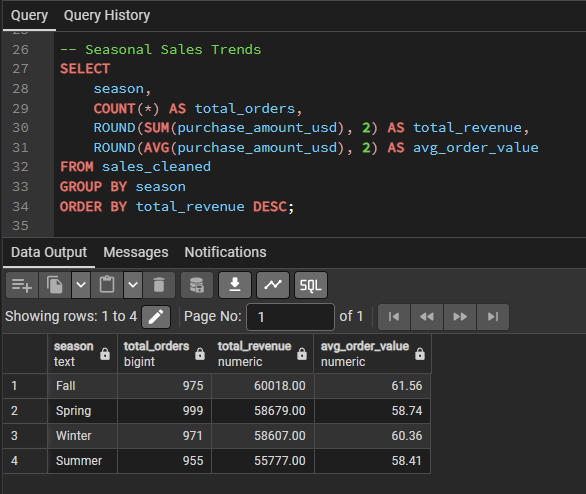

# Retail Sales Data Pipeline - PostgreSQL Project

### Project Overview

This project showcases an end-to-end **ELT and Analysis Pipeline** using **PostgreSQL**.  
The workflow follows three stages — **Extract**, **Load**, **Transform**, and **Analyze** — implemented entirely with SQL and Python for data ingestion.

The dataset simulates a retail sales environment containing simulated streaming transactions, customer demographics, product details, and purchase behavior.  
All data processing and analysis were performed using **pgAdmin 4** from PostgreSQL.

### Project Structure

- Simulated_Streaming_Data_Extraction/ - Python Script for PostgreSQL connection, Kaggle API calling, Simulate Streaming Data and Loading CSV into Database.
- data_cleaning.sql - SQL script to clean and prepare the data within the table.
- business_analysis.sql - SQL script to perform aggregated reporting and analytical queries.
- outputs/ - Contains Screenshots for each SQL query used in analysis.

### Tools & Technologies

- PostgreSQL 18 - Relational Database Engine
- pgAdmin 4 - SQL query execution and visualization
- Python - Libraries: 'os', 'time', 'pandas', 'psycopg2', 'datetime', 'kaggle', 'zipfile'

### Data Source

Website source: https://www.kaggle.com/datasets/bhadramohit/customer-shopping-latest-trends-dataset

### Data Pipeline/Workflow

The diagram below illustrates the end-to-end data pipeline for this project - from ELT to SQL query analysis. The process begins with sourcing from ibilik.my via Kaggle API call, PostgreSQL Database connection and loading of data, transform/clean and analyses using SQL queries.

### Key Analyses & Insights

1. Total Revenue
Total amount of revenue earned across 3900 customer records.
)

2. Average Spend by Gender.
Average spending segregated by gender across all transactions.
)

3. Top 5 Categories by Revenue
The top 5 categories of clothing wear ranked from highest to lowest in terms of revenue.
)

4. Seasonal Sale Trends
Total revenue earned across different seasons accompanied with total orders and average orders.
)

*(More query screenshots available in `/outputs` folder.)*